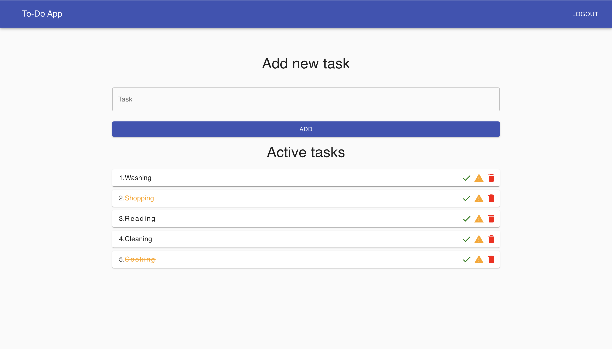

# A simple MERN app with 3 pages (routes):

SingUp - allows a user create a new account

SingIn - allows an authenticated user to use the app

Maimpage - allows the user to create, delete tasks, or mark then like 'done' and 'important'

# Demo:

email: test@mail.com

password: password

# Getting Started

To get started you can simply clone the repo and install the dependencies in the root folder

Steps: 

Install	npm install

Run	npm run dev

Runs the app in the development mode.

Open http://localhost:3000 to view it in the browser.

# Application:

ES6 + Features

Arrow Functions

Template Literals

Block-Scoped Variables Let and Const

async await with try/catch

Spread operator

Modules export/import

# Libraries/Frameworks:

materiar UI 

react-router-dom: The router components of react

axios: to make HTTP requests

nodejs: JS runtime for backend

express: server/web framework for nodejs to create server

express-validator: validator library for express framework

mongoose: mongodb database library for nodejs

bcryptjs: hashing library which is used to hash passwords in this project

jsonwebtoken: JWT implementation library

